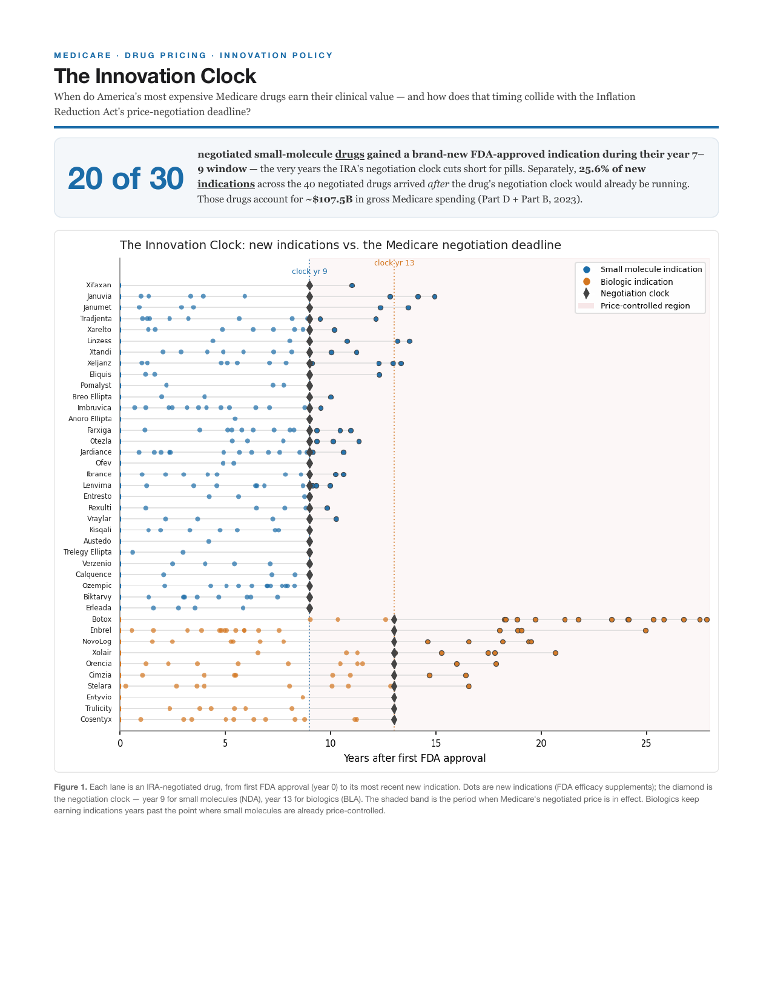
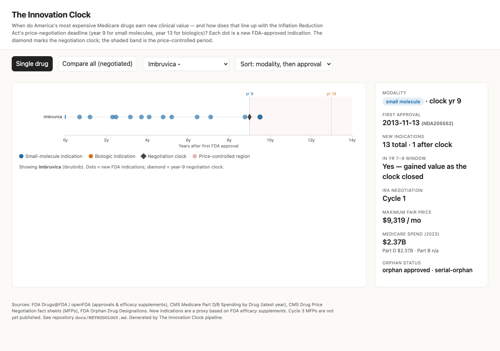
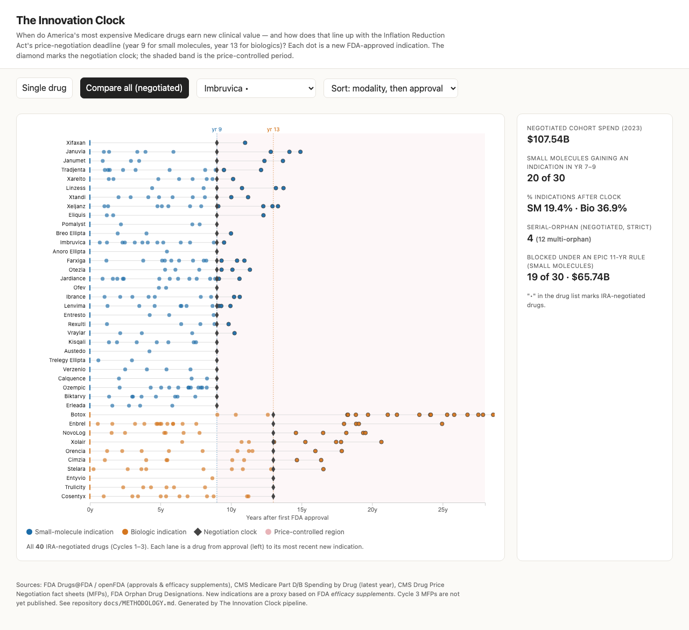

# The Innovation Clock

**When do America's most expensive Medicare drugs earn their clinical value — and how does that timing collide with the Inflation Reduction Act's price-negotiation deadline?**

This project maps every new FDA-approved indication for a cohort of high-spend Medicare drugs *relative to each drug's original approval*, then overlays the IRA's Medicare price-negotiation "clock" — **year 9 for small molecules (NDA), year 13 for biologics (BLA)** — to show what the timing means for (a) innovation incentives and (b) affordability. It ships a clean dataset, an interactive dashboard, a publication-ready fact sheet, and a fully reproducible pipeline.



---

## Headline findings

*(2023 Medicare gross spending; reproduced by `python -m src.analyze` — see [`docs/FINDINGS.md`](docs/FINDINGS.md))*

- **20 of 30** negotiated small-molecule drugs gained a brand-new FDA indication in their **year 7–9 window** — the very years the negotiation clock truncates for pills.
- **25.6%** of new *indications* (289 events across the 40 negotiated drugs) were approved *after* the drug's negotiation clock would already be in effect (small molecule 19.4%, biologic 36.9%).
- The 40 negotiated drugs represent **~$107.5B** of 2023 gross Medicare spending (our aggregation of CMS Spending-by-Drug data, Part D + Part B).
- **19 of the 30 negotiated small molecules** (**$65.7B**) would have been *unreachable* under an EPIC-style 11-year selection rule (biologics are unaffected by EPIC). Per cycle: 5/7, 8/15, 6/8 — consistent with Public Citizen's "5 of the first 10, 8 of the next 15" blocked drugs.
- **4** negotiated drugs are strict "serial-orphan" (multiple rare-disease indications, no non-orphan approval) and would be exempt under the One Big Beautiful Bill Act: Calquence, Imbruvica, Ofev, Pomalyst. (Lenvima is excluded — it also treats non-orphan renal cell and endometrial carcinoma.)

**The data cut both ways:** small molecules genuinely keep earning new indications inside the truncated window (the innovation-incentive argument), yet equalizing the clock with biologics would pull tens of billions of high-spend drugs out of negotiation (the affordability argument).

---

## Deliverables

| Deliverable | Path |
|---|---|
| Long dataset (one row per drug × indication event) | [`data/processed/innovation_clock_master.csv`](data/processed/innovation_clock_master.csv) |
| Wide dataset (one row per drug) | [`data/processed/innovation_clock_summary.csv`](data/processed/innovation_clock_summary.csv) |
| Interactive dashboard (single self-contained HTML) | [`dashboard/index.html`](dashboard/index.html) |
| Fact sheet (3 pages, PDF) | [`factsheet/factsheet.pdf`](factsheet/factsheet.pdf) |
| **Upload deliverable — 5-page fact sheet + Data & Methods / Reproduce appendix** | [`factsheet/Shahid_Abdullah_Innovation_Clock.pdf`](factsheet/Shahid_Abdullah_Innovation_Clock.pdf) |
| Notebook — code + analysis + inline plots + results in one place | [`notebooks/innovation_clock.ipynb`](notebooks/innovation_clock.ipynb) (or the rendered [`.html`](notebooks/innovation_clock.html)) |
| Findings, methodology, data dictionary | [`docs/`](docs/) |

### Dashboard

The site is a single self-contained file with three tabs — **Dashboard**, **Fact Sheet**, and **Methodology**. Open `dashboard/index.html` in any browser (`file://` works — data is embedded, no server needed; D3 loads from CDN). On the Dashboard tab, pick a drug for its Innovation Clock timeline + side panel (modality, spend, orphan status, IRA cycle/MFP), or switch to **Compare all** for the stacked negotiated cohort.

| Single drug | Compare all |
|---|---|
|  |  |

---

## How to run

```bash
# 1. install deps (Python 3.9+; 3.11+ recommended)
python -m pip install -r requirements.txt
python -m playwright install chromium      # for the PDF fact sheet

# 2. reproduce everything end-to-end (offline from cached raw data in data/raw/)
python -m src.run_all

#    options:
python -m src.run_all --refresh            # ignore cache, refetch all raw data live
python -m src.run_all --no-orphan          # skip the orphan enrichment layer
```

`run_all` builds the dataset → analyzes → renders charts → builds the dashboard → builds the fact sheet, then prints a **run summary** (headline stats, resolved/unresolved drugs, data gaps, and any human actions). Every raw API response is cached under `data/raw/`, so reruns are deterministic and offline-capable. To fetch live, set `OPENFDA_API_KEY` (optional, raises the openFDA rate limit) and run with `--refresh`.

Individual stages also run standalone, e.g. `python -m src.fetch_fda` (validates resolution on Eliquis/Enbrel/Calquence/Imbruvica/Entresto), `python -m src.cohort`, `python -m src.analyze`.

---

## Repository layout

```
innovation-clock/
├── src/
│   ├── cohort.py        # cohort = IRA Cycles 1–3 (cited constants) ∪ top-50 Part D spend
│   ├── fetch_fda.py     # resolve drugs → FDA apps; anchor approval, modality, indication events
│   ├── fetch_cms.py     # discover Part D/B Spending-by-Drug datasets; spend join
│   ├── fetch_orphan.py  # FDA OOPD orphan designations (enrichment)
│   ├── build_dataset.py # assemble the two processed CSVs + dashboard JSON
│   ├── analyze.py       # headline numbers → docs/FINDINGS.md
│   ├── charts.py        # matplotlib figures (SVG/PNG) for the fact sheet
│   ├── dashboard.py     # generate the self-contained D3 dashboard
│   ├── factsheet.py     # styled HTML → PDF (Playwright)
│   ├── run_all.py       # single entrypoint
│   └── util.py          # cached HTTP, name normalization, paths
├── data/
│   ├── raw/             # cached API responses (FDA, CMS, orphan) + policy_facts.json
│   └── processed/       # the two CSVs + dashboard_data.json + headline_stats.json
├── dashboard/index.html
├── factsheet/{factsheet.pdf, factsheet.html, figures/}
├── docs/{FINDINGS.md, METHODOLOGY.md, DATA_DICTIONARY.md, img/}
├── requirements.txt
└── LICENSE
```

---

## Data sources

All public, no authentication required.

- **FDA Drugs@FDA / openFDA** — approval dates, application type (modality), new-indication efficacy supplements. <https://api.fda.gov/drug/drugsfda.json>
- **CMS Medicare Part D & Part B Spending by Drug** (latest year, 2023) — total Medicare gross spend. <https://data.cms.gov>
- **CMS Medicare Drug Price Negotiation** fact sheets — selected drugs and Maximum Fair Prices (Cycles 1–3). <https://www.cms.gov/inflation-reduction-act-and-medicare/medicare-drug-price-negotiation>
- **FDA Orphan Drug Designations (OOPD)** — rare-disease enrichment. <https://www.accessdata.fda.gov/scripts/opdlisting/oopd/>

See [`docs/METHODOLOGY.md`](docs/METHODOLOGY.md) for every cleaning decision and limitation, and [`data/raw/policy_facts.json`](data/raw/policy_facts.json) for cited policy facts.

## Caveats (short version)

"New indications" are FDA **efficacy supplements** — a documented proxy that can include some population/line-of-therapy expansions. **Cycle 3 (IPAY 2028) Maximum Fair Prices are not yet published** and are left `null` (never invented). Two vaccine entries (Arexvy, Shingrix) don't resolve because CMS antigen names don't map to FDA active ingredients. Insulin aspart resolves as a biologic due to FDA's 2020 insulin BLA transition. Xolair's Part B classification is contested. Full detail in the methodology doc.

## License

[MIT](LICENSE). Analysis is for research/education — **not** medical, investment, or legal advice.
